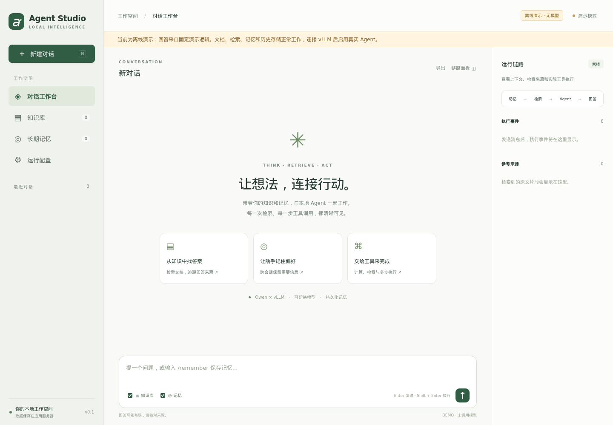
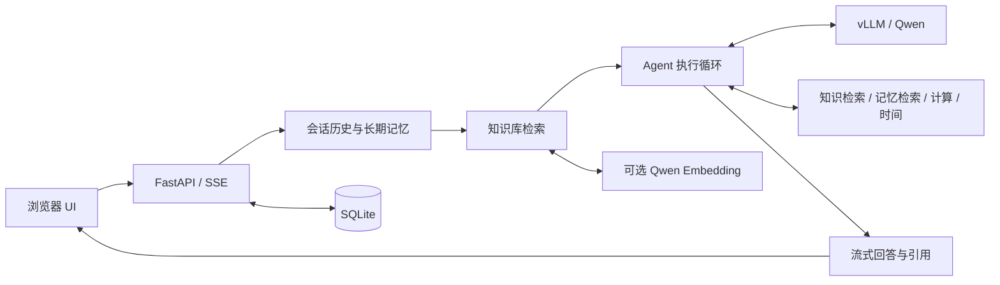

# Agent Studio

一个可本地部署的完整 Agent 项目：**Qwen + vLLM 推理、工具调用循环、Memory、RAG、中文 Web UI、持久化与执行追踪**。代码位于 `/home/yw784/Projects/Agent`。



## 已实现的链路



| 模块 | 实现 |
| --- | --- |
| 推理 | OpenAI 兼容 HTTP 接口；真实 SSE 文本增量；原生 function calling；token 用量 |
| Agent | 自动上下文准备 → 模型决策 → 参数校验 → 工具执行 → 最终回答；限制轮次、防重复调用 |
| 短期 Memory | SQLite 会话历史；保留完整的最近轮次；更早消息生成有界的摘录式上下文 |
| 长期 Memory | 用户主动保存的偏好与事实；跨会话召回；可删除；支持 `/remember` 和 `记住：` |
| RAG | TXT / MD / PDF / CSV / JSON；重叠分块；SHA256 去重；文档与 PDF 页码引用 |
| 检索 | 默认中英文 BM25；可选 Qwen3 Embedding + 余弦检索 + BM25，使用 RRF 融合排序 |
| UI | 多会话、流式对话、停止、执行记录、来源预览、知识库管理、记忆管理、导出、手机布局 |
| 可靠性 | 文档入库/重建索引原子提交；失败回答不进入历史；断线取消；索引配置变化检测 |
| 部署 | 独立 Python 环境、vLLM 启动脚本、Docker Compose、依赖锁定、测试与 HTTP 冒烟 |

本项目面向**单用户本地工作空间**。应用与推理进程分离；应用本身不依赖 PyTorch，不会改变其他项目的模型环境。

## 立即启动 UI

当前目录已经创建并安装 `.venv`。先体验无需 GPU 的完整界面与数据流程：

```bash
cd /home/yw784/Projects/Agent
make demo
```

打开 **http://127.0.0.1:8080**。在知识库点击“导入示例文档”，然后提问“项目架构是什么？”。

**Demo 使用明确标注的固定回答逻辑，没有模型推理，也不具备自主工具规划能力。** 上传、检索、记忆、历史与导出使用真实实现。它不会作为 vLLM 故障后的隐式回退。

在新机器安装（Python 3.11+）：

```bash
cd /path/to/Agent
python3 -m venv .venv
.venv/bin/python -m pip install -r requirements.lock
.venv/bin/python -m pip install -e '.[dev]'
cp .env.example .env
make demo
```

前端由 FastAPI 直接托管，无需 Node、npm 或 CDN。

## 接入真实 Qwen / vLLM

默认模型为 `Qwen/Qwen3-4B-Instruct-2507`。低资源机器可以切换为 `Qwen/Qwen3-1.7B` 或 `Qwen/Qwen3-0.6B`；模型越小，多步工具调用质量越需要针对任务评估。

### 1. 在 GPU 机器准备独立推理环境

```bash
python3 -m venv .venv-inference
source .venv-inference/bin/activate
pip install 'vllm==0.11.0' 'python-dotenv>=1,<2'
```

项目提供的命令与 Compose 对齐 vLLM 0.11.0。GPU 驱动与 CUDA 要满足所选 vLLM 版本的要求。首次启动会下载模型权重。

### 2. 启动聊天模型

在项目根目录复制并编辑 `.env`，保持 `AW_MODE=vllm`：

```bash
# 在上面的推理环境中
python scripts/serve_vllm.py chat
```

等价核心命令：

```bash
vllm serve Qwen/Qwen3-4B-Instruct-2507 \
  --host 127.0.0.1 --port 8000 \
  --api-key local-dev-key \
  --max-model-len 16384 \
  --gpu-memory-utilization 0.65 \
  --max-num-seqs 8 \
  --enable-auto-tool-choice --tool-call-parser hermes
```

应用在每次请求中发送 `chat_template_kwargs.enable_thinking=false`，适配普通 Qwen3 小模型的非思考模式；4B Instruct 2507 本身是非思考模型。没有把请求参数误当成旧版 vLLM 的 CLI 参数。

可以用 `python scripts/serve_vllm.py chat --dry-run` 检查实际参数；API key 会被遮蔽。

### 3. 启动应用

新终端：

```bash
cd /home/yw784/Projects/Agent
make run
```

打开 http://127.0.0.1:8080 ，右上角应显示“服务已连接”。

已有 vLLM 服务时，只需修改：

```dotenv
AW_MODE=vllm
AW_LLM_BASE_URL=http://你的推理机器:8000/v1
AW_LLM_MODEL=服务实际公布的模型名
AW_LLM_API_KEY=你的服务密钥
```

`AW_LLM_MODEL` 必须匹配 `GET /v1/models`，如果设置了 `--served-model-name`，这里使用对应别名。修改 `.env` 后重启应用。

切换小模型时，同时修改 `AW_LLM_MODEL` 并重启相应 vLLM 服务：

```dotenv
AW_LLM_MODEL=Qwen/Qwen3-1.7B
```

0.6B 可用于低成本连通性检查；默认 4B 是本项目的起始配置，不代表已测得最优效果。显存占用还取决于上下文、并发、精度与 vLLM 预分配，不能仅按参数量判断。

## 启用向量 RAG

默认 `AW_EMBEDDING_BACKEND=bm25` 是可用的关键词检索，没有伪造向量。启用语义检索：

```bash
# 在 GPU 推理环境中，另一个终端
python scripts/serve_vllm.py embedding
```

然后修改应用 `.env`：

```dotenv
AW_EMBEDDING_BACKEND=vllm
AW_EMBEDDING_BASE_URL=http://127.0.0.1:8001/v1
AW_EMBEDDING_MODEL=Qwen/Qwen3-Embedding-0.6B
AW_EMBEDDING_API_KEY=local-dev-key
```

重启应用，在知识库中点击**重建索引**。更换向量模型、服务地址或后端后都需重建；失败时保留原索引。应用使用 Qwen 的 query instruction 格式，并对向量归一化。

默认聊天与 Embedding 使用同一张 GPU，分别预留 0.65 和 0.20 的显存比例。若空间不足，降低上下文或改用更小模型；也可设置 `VLLM_EMBED_GPU=1` 使用第二张卡。不要把同卡两个进程的显存比例都设成 0.9。

## Docker Compose

需要 Docker Compose 2.24+，GPU 服务还需要 NVIDIA Container Toolkit。

```bash
cp .env.example .env
# 编辑 .env；容器内地址由 compose.yaml 自动设为服务名

# 只有演示 UI，无 GPU
AW_MODE=demo docker compose up --build -d app

# Qwen 聊天 + BM25
docker compose --profile gpu up --build -d

# 完整聊天 + Qwen Embedding 混合 RAG
# 先在 .env 中设 AW_EMBEDDING_BACKEND=vllm
docker compose --profile gpu --profile embedding up --build -d

docker compose logs -f app vllm-chat
```

应用发布到本机 8080，推理服务只在 Compose 网络中可见。数据保存在 `agent-data` 卷，模型缓存保存在 `model-cache` 卷。模型首次下载/加载期间 UI 会显示服务未就绪，应用不伪装成已连接。

`compose.yaml` 面向一起启动的推理服务。使用外部推理服务器时可直接运行 Python 应用，或通过 Compose override 覆盖两个 Base URL。

## 使用示例

1. 知识库导入 `workbench/static/example.md` 或自己的资料。
2. 输入：`项目由哪些模块组成？请引用资料。`
3. 输入：`/remember 我偏好中文解释，代码用 Python。`
4. 新建会话后继续提问，执行面板可查看本次实际召回的记忆。
5. 真实模型下输入：`请调用 calculate 计算 (128 * 24 + 960) / 12。`
6. 点击来源卡片查看原文；“查看本轮执行记录”可回看参数、结果和 token 用量。

长对话的摘录是有损的，不能代替长期记忆；需要保留的事实请主动保存。长期记忆在此单用户工作空间内共享，不因删除某个会话而消失。

## 验证

```bash
make test
make lint
# 应用启动后；临时测试数据会自动清理
make smoke
# 验证真实 vLLM 连接
.venv/bin/python scripts/smoke.py --require-vllm
```

可选浏览器验证：

```bash
.venv/bin/python -m pip install playwright
.venv/bin/python -m playwright install chromium
.venv/bin/python scripts/browser_smoke.py
```

浏览器脚本会创建独立临时数据目录和端口，验证桌面/手机 UI，结束后停止服务。结果截图在 [docs/screenshots](docs/screenshots)。实际验证范围见 [VALIDATION.md](docs/VALIDATION.md)。

## 项目结构

```text
Agent/
├── workbench/
│   ├── api.py          # REST、SSE、上传、访问控制、取消
│   ├── agent.py        # 上下文准备与工具循环
│   ├── providers.py    # vLLM Chat/Embedding HTTP 协议
│   ├── memory.py       # 长期召回与有界会话上下文
│   ├── rag.py          # 解析、分块、BM25、向量检索与 RRF
│   ├── tools.py        # 工具 schema、校验和执行
│   ├── db.py           # SQLite 事务、会话、记忆、来源、执行事件
│   ├── config.py       # .env 配置与校验
│   └── static/         # 原生 JS/CSS 中文 UI 与示例资料
├── scripts/            # vLLM 启动、HTTP 与浏览器冒烟
├── tests/              # 应用、检索、协议、取消的自动化测试
├── requirements.lock   # 本次验证的运行依赖版本
├── compose.yaml
├── Dockerfile
└── .env.example
```

## API 与事件

运行后访问 `/docs` 获取 OpenAPI 文档。主要接口：

| 接口 | 用途 |
| --- | --- |
| `GET /healthz` | 应用存活；不代表模型可用 |
| `GET /api/health` | 聊天与 Embedding 服务就绪检查 |
| `GET/POST /api/sessions` | 列出/创建会话 |
| `GET/PATCH/DELETE /api/sessions/{id}` | 历史、重命名、删除 |
| `POST /api/sessions/{id}/chat` | SSE 聊天 |
| `GET /api/sessions/{id}/export` | 导出消息与来源 JSON |
| `GET /api/runs/{id}` | 回看执行记录 |
| `GET/POST /api/documents` | 文档列表/上传 |
| `GET/DELETE /api/documents/{id}` | 查看分块/删除 |
| `POST /api/knowledge/search` | 独立检索测试 |
| `POST /api/knowledge/reindex` | 原子重建向量索引 |
| `GET/POST /api/memories` | 读取/保存记忆 |
| `DELETE /api/memories/{id}` | 删除记忆 |

聊天请求：

```json
{"message":"项目架构是什么？","use_rag":true,"use_memory":true}
```

SSE 事件包括 `run`、`stage`、`memory`、`sources`、`context`、`response_start`、`delta`、`tool_call`、`tool_result`、`usage`、`memory_saved`、`done`、`error`。每个模型轮次发送 `response_start`，客户端据此替换中间文本；只有 `done` 后的最终回答入库。非文本增量事件持久化用于回看。

## 配置与边界

- **本地单用户、单进程**：使用一个 Uvicorn worker。同一会话只能同时运行一个请求；不同会话可并发。多租户、分布式任务队列和企业身份认证不在当前实现范围内。
- **数据**：默认 `data/workbench.sqlite3`，使用 WAL 与外键。运行中备份请用 SQLite backup API；停服后可以复制整个数据目录。不要只复制活跃数据库的主文件。
- **访问**：默认绑定 `127.0.0.1`。远程访问可用 SSH 隧道：`ssh -L 8080:127.0.0.1:8080 user@server`。共享网络部署时设置 `AW_API_TOKEN`，并在 UI 运行配置中填入，外层使用 HTTPS。
- **工具**：只有知识库、记忆、数学和时间工具；不执行任意 shell/Python，不自动访问外部网页。新增工具需在 `tools.py` 注册参数模型、schema 和实现。
- **检索规模**：SQLite 保存向量，精确线性扫描，默认最多 10,000 个块，适合小型个人知识库；大规模语料可替换为专用向量库。
- **文档**：默认 10 MiB、500,000 提取字符；PDF 最多 200 页；不含 OCR、DOCX 或网页抓取。
- **上下文**：使用字符预算而非模型精确 tokenizer。提高 `AW_CONTEXT_CHARS` / `AW_MAX_TOKENS` 时，要同步确认 vLLM 的 `--max-model-len`。
- **停止语义**：断开 SSE 会取消未完成的上游请求。完整回答若已提交，不会被晚到的取消改为失败。明确的记忆保存命令会立即保存，之后取消连接不回滚该记忆。
- **模型质量**：引用卡片对应真实检索原文，但不保证生成的每个结论正确；小模型的工具选择与参数质量仍需真实任务评测。
- **故障处理**：服务错误、超时、截断、无效工具参数均可见；不会把失败流写成成功回答。推理请求不自动重试，以避免重复执行。
- **当前验证限制**：开发节点没有可用 NVIDIA GPU，也没有 Docker 命令。已验证应用、协议和浏览器；尚未运行真实 GPU 模型或构建容器镜像。

官方参数依据：[vLLM 0.11 工具调用](https://docs.vllm.ai/en/v0.11.0/features/tool_calling.html)、[vLLM Pooling](https://docs.vllm.ai/en/v0.11.0/models/pooling_models.html)、[Qwen3 4B Instruct](https://huggingface.co/Qwen/Qwen3-4B-Instruct-2507)、[Qwen3 Embedding 0.6B](https://huggingface.co/Qwen/Qwen3-Embedding-0.6B)。
